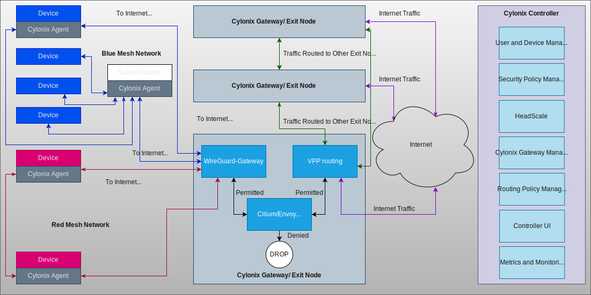

# Cylonix System Diagram

## Diagram Explanation

This diagram illustrates the Cylonix architecture, which is divided into three logical planes: the **End User Network** (where devices connect from), the **Cylonix Data Plane** (where traffic is processed and routed), and the **Cylonix Control Plane** (the central brain for management and policy).

### 1. End User Network (The "Clients")

This plane represents the devices connecting to the Cylonix service.

* **Computing Devices:** These are endpoints like laptops, servers, or IoT devices. They connect in one of two ways:
* **Cylonix Node Agent:** A software agent is installed directly on the device. It establishes a secure WireGuard tunnel to a Cylonix Gateway and manages peer-to-peer mesh connections. This is based on Tailscale®
* **Subnet Router:** A gateway device (like a router in an office or a VPC) runs the Cylonix agent on behalf of an entire subnet. It advertises the local network routes, allowing devices behind it to access the Cylonix network without needing individual agents.
* **Tailscale® WireGuard® Mesh Network:** As indicated by the red or blue lines, devices can form a direct, encrypted mesh network with each other. This is orchestrated by the Control Plane, which distributes the necessary cryptographic public keys and peer information based on security policies. The private keys are only stored in the device and never collected or stored in the controller. This allows for low-latency communication between devices without having to route traffic through a central gateway.

#### 2. Cylonix Data Plane (The "Gateway / Exit Node")

This is the workhorse of the system, responsible for terminating tunnels, enforcing security, and routing traffic efficiently. A Cylonix deployment can have multiple gateways distributed globally for performance and redundancy.

* **Cylonix Gateway (aka Exit Node):** A single gateway contains three key functional components that work in concert.

  * **Wg-Gateway (WireGuard® Termination):**
    * This is the entry point for all traffic from Node Agents and Subnet Routers.
    * It terminates the encrypted WireGuard tunnels.
    * It supports **Linux VRF (Virtual Routing and Forwarding)** for multi-tenancy, creating isolated routing tables for different organizations or user groups on the same physical server. Each VRF is associated with a specific network interface.

  * **Cilium® Firewall (eBPF + Envoy):**
    * This component acts as a highly efficient, programmable firewall.
    * Using **eBPF**, it hooks directly into the Linux kernel to monitor traffic on the Wg-Server's network interfaces with minimal overhead.
    * It enforces Layer 3/4 firewall rules (IPs, ports) based on policies from the Control Plane.
    * For Layer 7 inspection (e.g., HTTP/gRPC filtering), it integrates with **Envoy Proxy** to provide advanced application-aware security.

  * **VPP-based Routing Service:**
    * This is a high-performance routing engine based on the Vector Packet Processing (VPP) framework. It receives its routing table and policies from the Control Server. It handles three primary traffic scenarios:
    * **Intra-Gateway / Inter-Mesh Routing:** When two devices are connected to the same Gateway but are not allowed to mesh directly, traffic flows from Device A -> Wg-Server -> Cilium Firewall -> VPP Router, which then routes it back to the Wg-Server -> Cilium Firewall -> Device B.
    * **Inter-Gateway Routing:** For performance and routing optimization, traffic destined for a device connected to a different Cylonix Gateway is routed directly to that remote gateway over a secure backbone link.
    * **Internet Egress:** Based on policy, traffic destined for the public internet is routed out through the Gateway's WAN links, effectively acting as a secure internet gateway or "Exit Node". SD-WAN policies can be enfored here.

#### 3. Cylonix Control Plane (The "Controller")

This is the centralized management and intelligence hub of the entire system. It does not handle user data traffic but is critical for orchestration, policy, and monitoring.

* **Headscale Service:** A forked version of the open-source implementation of the Tailscale coordination server to support multi-tenants and mulitple mesh networks within a tenant. It is responsible for the core mesh networking logic: handling node registration, exchanging public keys between peers, and generating the network map for all agents.
* **User & Device & Access Management:** This service manages identities (users, groups, service accounts), devices, and the access control policies that define "who can talk to what." It integrates with Headscale to translate high-level security policies into the low-level network map.
* **Supervisor Service:** This service is responsible for the lifecycle management of the Cylonix Gateways. It maintains an inventory of all gateways and their running services (Wg-Server, Cilium, VPP), pushes configuration updates, and ensures they are operating correctly.
* **Cylonix-Manager UI:** The web-based graphical user interface that administrators use to interact with the Control Plane. They can manage users, define policies, view the network status, and configure gateways through this UI, which communicates with the backend management services.
* **Monitoring Services:** A suite of tools (e.g., Prometheus) that collects, stores, and visualizes metrics, logs, and traces from all components in the system, especially the Cylonix Gateways. This provides visibility into the health, performance, and security of the entire Cylonix service.

## Trademarks

“Tailscale” is a trademark of Tailscale Inc.  
“WireGuard” is a registered trademark of Jason A. Donenfeld.
"Cilium" is a registered trademark of Isovalent Inc.
All other trademarks are property of their respective owners.
